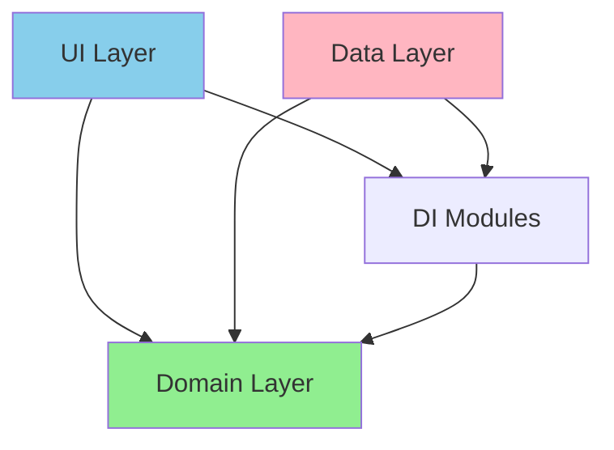

# Relatório de Análise - Finance Project

## 📋 Resumo Executivo

O projeto Finance é uma aplicação **Kotlin Multiplatform** (Android/Desktop) de controle financeiro pessoal, construída com **Compose Multiplatform**. A análise revela uma arquitetura bem estruturada seguindo princípios de **Clean Architecture**, com separação clara de responsabilidades e uso consistente de design patterns modernos.

**Pontuação Geral: 8.5/10**

---

## 🏗️ Arquitetura

### Estrutura de Camadas

O projeto segue uma **Clean Architecture** bem definida com 3 camadas principais:

```
┌─────────────────────────────────────┐
│         UI Layer (Compose)          │
│  - Screens, Components, Modals      │
│  - ViewModels (State Management)    │
└──────────────┬──────────────────────┘
               │
┌──────────────▼──────────────────────┐
│         Domain Layer                │
│  - Models (Transaction, Category)   │
│  - Use Cases (Business Logic)       │
│  - Repository Interfaces            │
└──────────────┬──────────────────────┘
               │
┌──────────────▼──────────────────────┐
│         Data Layer                  │
│  - Repository Implementations       │
│  - DAOs, Entities, Mappers          │
│  - Room Database                    │
└─────────────────────────────────────┘
```

### ✅ Pontos Fortes

1. **Separação de Responsabilidades Clara**
   - Camada de domínio completamente independente de frameworks
   - Interfaces de repositório no domínio, implementações na camada de dados
   - UI não acessa diretamente a camada de dados

2. **Inversão de Dependências**
   - Uso correto de interfaces (`ITransactionRepository`, `ICategoryRepository`)
   - Dependências apontam sempre para abstrações

3. **Organização de Pacotes Coerente**
   ```
   com.neoutils.finance/
   ├── domain/          # Regras de negócio puras
   ├── database/        # Implementação de persistência
   ├── ui/              # Interface do usuário
   ├── di/              # Injeção de dependências
   └── extension/       # Funções utilitárias
   ```

### ⚠️ Pontos de Atenção

1. **Ausência de Camada de Presentation/UI Models**
   - Componentes UI recebem diretamente modelos de domínio (`Transaction`, `Category`)
   - Lógica de apresentação (formatação, cores, ícones) está espalhada nos Composables
   - **Recomendação**: Criar UI Mappers para transformar domain models em UI models

2. **ViewModels com Múltiplas Responsabilidades**
   - `TransactionsViewModel` gerencia estado, filtros, navegação de mês e ajustes de saldo
   - **Recomendação**: Considerar extrair lógica de filtros para use cases específicos

---

## 🎨 Design Patterns

### Patterns Implementados

#### 1. **Repository Pattern** ⭐⭐⭐⭐⭐
```kotlin
// Interface no domínio
interface ITransactionRepository {
    suspend fun insert(transaction: Transaction): Long
    fun getAllTransactions(): Flow<List<Transaction>>
    // ...
}

// Implementação na camada de dados
class TransactionRepository(
    private val dao: TransactionDao,
    private val categoryRepository: ICategoryRepository,
    private val mapper: TransactionMapper
) : ITransactionRepository
```

**Avaliação**: Excelente implementação. Abstração bem definida, uso de Flows para reatividade.

#### 2. **Use Case Pattern** ⭐⭐⭐⭐⭐
```kotlin
class CalculateBalanceUseCase {
    operator fun invoke(
        transactions: List<Transaction>,
        upToYearMonth: YearMonth
    ): Double {
        return transactions
            .filter { it.date.yearMonth <= upToYearMonth }
            .sumOf { /* lógica de cálculo */ }
    }
}
```

**Avaliação**: Excelente. Use cases encapsulam regras de negócio específicas:
- `CalculateBalanceUseCase`
- `AdjustBalanceUseCase`
- `CalculateCategorySpendingUseCase`
- `CalculateTransactionStatsUseCase`

Cada use case tem responsabilidade única e bem definida.

#### 3. **Mapper Pattern** ⭐⭐⭐⭐
```kotlin
class TransactionMapper {
    fun toDomain(entity: TransactionEntity, category: Category?): Transaction
    fun toEntity(domain: Transaction): TransactionEntity
}
```

**Avaliação**: Boa implementação para conversão Entity ↔ Domain. 

**Oportunidade de Melhoria**: Falta mapper Domain → UI para separar lógica de apresentação.

#### 4. **Dependency Injection (Koin)** ⭐⭐⭐⭐⭐
```kotlin
val viewModelModule = module {
    viewModel {
        DashboardViewModel(
            repository = get(),
            adjustBalanceUseCase = get(),
            calculateBalanceUseCase = get(),
            // ...
        )
    }
}
```

**Avaliação**: Excelente organização em módulos separados:
- `DatabaseModule`
- `MapperModule`
- `RepositoryModule`
- `UseCaseModule`
- `ViewModelModule`

#### 5. **State Management (MVI-like)** ⭐⭐⭐⭐
```kotlin
sealed interface TransactionsAction {
    data class AdjustBalance(val target: Double) : TransactionsAction
    data class SelectCategory(val category: Category?) : TransactionsAction
    // ...
}

fun onAction(action: TransactionsAction) {
    when (action) {
        is TransactionsAction.AdjustBalance -> adjustBalance(action.target)
        // ...
    }
}
```

**Avaliação**: Boa abordagem unidirecional de fluxo de dados. Actions bem definidas.

#### 6. **Modal Manager Pattern** ⭐⭐⭐⭐⭐
```kotlin
class ModalManager {
    private var modalState = mutableStateListOf<Modal>()
    
    fun show(modal: Modal) {
        modalState.add(modal)
    }
}
```

**Avaliação**: Solução elegante para gerenciamento de modais com CompositionLocal. Permite empilhamento de modais.

---

## 💻 Qualidade de Código

### Nomenclatura ⭐⭐⭐⭐⭐

**Pontos Fortes**:
- Nomes descritivos e auto-explicativos
- Convenções Kotlin seguidas consistentemente
- Uso adequado de `I` prefix para interfaces (`ITransactionRepository`)
- Sufixos claros: `UseCase`, `Repository`, `Mapper`, `ViewModel`

**Exemplos**:
```kotlin
// ✅ Excelente nomenclatura
class CalculateCategorySpendingUseCase
fun Double.toMoneyFormatWithSign()
sealed interface TransactionsAction
```

### Coesão e Acoplamento ⭐⭐⭐⭐

**Alta Coesão**:
- Use cases focados em uma única responsabilidade
- Mappers dedicados a conversões específicas
- Componentes UI reutilizáveis

**Baixo Acoplamento**:
- Dependências via interfaces
- Injeção de dependências bem aplicada
- Camadas independentes

**Ponto de Atenção**:
```kotlin
// TransactionCard recebe Transaction + Category separadamente
TransactionCard(
    transaction = transaction,
    category = transaction.category,  // Redundante
    // ...
)
```
**Recomendação**: Simplificar para receber apenas `transaction`.

### Complexidade ⭐⭐⭐⭐

**Pontos Fortes**:
- Funções pequenas e focadas
- Lógica de negócio isolada em use cases
- Uso eficiente de extension functions

**Exemplo de Boa Prática**:
```kotlin
// Extension function para filtros
private fun List<Transaction>.filter(category: Category?): List<Transaction> {
    if (category == null) return this
    return filter { it.category?.id == category.id }
}
```

**Ponto de Atenção**:
```kotlin
// TransactionsViewModel tem muitas responsabilidades
class TransactionsViewModel(
    private val transaction: Transaction.Type?,
    private val category: Category?,
    // ... 5 dependências
) {
    // Gerencia: estado, filtros, navegação, ajustes
}
```

### Code Smells Identificados

#### 1. **Lógica de Apresentação em Composables** 🟡
```kotlin
// TransactionCard.kt - Lógica de UI espalhada
Surface(
    color = when (transaction.type) {
        Transaction.Type.INCOME -> Income.copy(alpha = 0.2f)
        Transaction.Type.EXPENSE -> Expense.copy(alpha = 0.2f)
        Transaction.Type.ADJUSTMENT -> Adjustment.copy(alpha = 0.2f)
    }
)
```
**Impacto**: Médio  
**Recomendação**: Mover para UI Mapper ou criar `TransactionUi` model.

#### 2. **Strings Hardcoded** 🟡
```kotlin
// Strings não localizadas
Text("Categoria")
Text("Tipo")
Text("Ajuste de Saldo")
```
**Impacto**: Médio  
**Recomendação**: Criar sistema de resources/strings para i18n.

#### 3. **Magic Numbers** 🟢
```kotlin
// Valores mágicos sem contexto
.take(3)  // Por que 3?
SharingStarted.WhileSubscribed(5000)  // Por que 5000ms?
```
**Impacto**: Baixo  
**Recomendação**: Extrair para constantes nomeadas.

#### 4. **Duplicação de Lógica** 🟡
```kotlin
// Lógica de formatação de dinheiro duplicada
fun Double.toMoneyFormat(): String { /* ... */ }
fun Double.toMoneyFormatWithSign(): String { /* ... */ }
// Implementações quase idênticas
```
**Impacto**: Médio  
**Recomendação**: Refatorar para eliminar duplicação.

---

## 🎯 Gerenciamento de Estado

### Abordagem Reativa ⭐⭐⭐⭐⭐

**Pontos Fortes**:
```kotlin
val uiState = repository.getAllTransactions()
    .map { transactions ->
        // Transformação para UI State
        DashboardUiState(/* ... */)
    }
    .stateIn(
        scope = viewModelScope,
        started = SharingStarted.WhileSubscribed(5000),
        initialValue = DashboardUiState()
    )
```

- Uso consistente de `Flow` e `StateFlow`
- `collectAsStateWithLifecycle` nos Composables
- Estado imutável com `data class`
- Single source of truth

### Estado UI Bem Estruturado ⭐⭐⭐⭐
```kotlin
data class TransactionsUiState(
    val transactions: Map<LocalDate, List<Transaction>> = emptyMap(),
    val balanceOverview: BalanceOverview = BalanceOverview(),
    val selectedYearMonth: YearMonth = YearMonth(0, 0),
    val categories: List<Category> = emptyList(),
    val selectedCategory: Category? = null,
    val selectedType: Transaction.Type? = null,
)
```

**Pontos Fortes**:
- Valores padrão sensatos
- Estrutura hierárquica clara
- Imutabilidade garantida

---

## 🧩 Componentes UI

### Composables Reutilizáveis ⭐⭐⭐⭐

**Componentes Bem Projetados**:
- `TransactionCard` - Exibição de transação
- `CategoryCard` - Exibição de categoria
- `CategorySpendingCard` - Gastos por categoria
- `SummaryCard` - Resumo financeiro
- `MonthSelector` - Seletor de mês
- `CategoryIconBox` - Ícone de categoria

**Pontos Fortes**:
- Modifiers expostos para flexibilidade
- Callbacks bem definidos
- Preview annotations (quando aplicável)

**Oportunidade de Melhoria**:
```kotlin
// Componente recebe dados de domínio diretamente
@Composable
fun TransactionCard(
    transaction: Transaction,  // Domain model
    category: Category?,       // Domain model
    onClick: () -> Unit,
    modifier: Modifier = Modifier
)
```
**Recomendação**: Criar `TransactionUi` para encapsular lógica de apresentação.

---

## 📊 Análise de Dependências

### Estrutura de Módulos



### Dependências Externas

**Core**:
- Kotlin Multiplatform
- Compose Multiplatform
- Kotlin Coroutines & Flow

**DI**:
- Koin (lightweight, adequado para o projeto)

**Database**:
- Room (inferido pelo uso de DAOs)

**Avaliação**: Stack moderna e adequada. Sem over-engineering.

---

## 🔍 Pontos Fortes do Projeto

### 1. **Arquitetura Sólida** ⭐⭐⭐⭐⭐
- Clean Architecture bem implementada
- Separação clara de responsabilidades
- Testabilidade facilitada

### 2. **Use Cases Bem Definidos** ⭐⭐⭐⭐⭐
- Lógica de negócio isolada
- Reutilizáveis e composáveis
- Fácil manutenção

### 3. **Reatividade Consistente** ⭐⭐⭐⭐⭐
- Uso eficiente de Flows
- Estado reativo em toda aplicação
- Performance otimizada

### 4. **Injeção de Dependências** ⭐⭐⭐⭐⭐
- Módulos bem organizados
- Fácil substituição de implementações
- Testabilidade aprimorada

### 5. **Código Limpo** ⭐⭐⭐⭐
- Nomenclatura consistente
- Funções pequenas e focadas
- Boa legibilidade

---

## 🚀 Recomendações de Melhoria

### Prioridade Alta 🔴

#### 1. **Implementar Camada de Presentation Models**
```kotlin
// Criar UI Models
data class TransactionUi(
    val id: Long,
    val title: String,
    val formattedAmount: String,
    val formattedDate: String,
    val iconKey: String,
    val backgroundColor: Color,
    val textColor: Color
)

// Criar UI Mappers
class TransactionUiMapper {
    fun toUi(transaction: Transaction): TransactionUi {
        // Toda lógica de apresentação aqui
    }
}
```

**Benefícios**:
- Composables mais simples e focados em renderização
- Lógica de apresentação centralizada e testável
- Facilita mudanças de design

#### 2. **Extrair Strings para Resources**
```kotlin
// Criar sistema de strings
object Strings {
    const val CATEGORY = "Categoria"
    const val TYPE = "Tipo"
    const val BALANCE_ADJUSTMENT = "Ajuste de Saldo"
    // ...
}
```

**Benefícios**:
- Preparação para internacionalização
- Consistência de textos
- Manutenção facilitada

### Prioridade Média 🟡

#### 3. **Refatorar Extension Functions Duplicadas**
```kotlin
fun Double.toMoneyFormat(showSign: Boolean = false): String {
    val isNegative = this < 0
    val absoluteValue = abs(this)
    // ... lógica comum
    
    return when {
        !showSign -> formatted
        isNegative -> "-$formatted"
        this > 0 -> "+$formatted"
        else -> formatted
    }
}
```

#### 4. **Adicionar Constantes Nomeadas**
```kotlin
object UiConstants {
    const val RECENT_TRANSACTIONS_LIMIT = 3
    const val TOP_CATEGORIES_LIMIT = 3
    const val STATE_FLOW_TIMEOUT_MS = 5000L
}
```

#### 5. **Simplificar Assinaturas de Componentes**
```kotlin
// Antes
TransactionCard(
    transaction = transaction,
    category = transaction.category,  // Redundante
    onClick = { }
)

// Depois
TransactionCard(
    transaction = transaction,
    onClick = { }
)
```

### Prioridade Baixa 🟢

#### 6. **Adicionar Documentação KDoc**
```kotlin
/**
 * Calcula o saldo total até um determinado mês.
 *
 * @param transactions Lista de todas as transações
 * @param upToYearMonth Mês limite para o cálculo (inclusive)
 * @return Saldo calculado considerando receitas, despesas e ajustes
 */
class CalculateBalanceUseCase {
    operator fun invoke(/* ... */) { }
}
```

#### 7. **Adicionar Testes Unitários**
```kotlin
class CalculateBalanceUseCaseTest {
    @Test
    fun `should calculate balance correctly with mixed transactions`() {
        // Arrange
        val transactions = listOf(/* ... */)
        val useCase = CalculateBalanceUseCase()
        
        // Act
        val result = useCase(transactions, YearMonth(2024, 12))
        
        // Assert
        assertEquals(1500.0, result)
    }
}
```

---

## 📈 Métricas de Qualidade

| Aspecto | Pontuação | Observação |
|---------|-----------|------------|
| **Arquitetura** | 9/10 | Clean Architecture bem implementada |
| **Design Patterns** | 9/10 | Uso consistente e apropriado |
| **Nomenclatura** | 10/10 | Excelente clareza e consistência |
| **Coesão** | 8/10 | Alta, com pequenas oportunidades |
| **Acoplamento** | 9/10 | Baixo, bem desacoplado |
| **Testabilidade** | 8/10 | Boa estrutura, faltam testes |
| **Manutenibilidade** | 8/10 | Código limpo e organizado |
| **Reatividade** | 10/10 | Excelente uso de Flows |
| **DI** | 10/10 | Koin bem configurado |
| **UI/UX Code** | 7/10 | Lógica de apresentação espalhada |

**Média Geral: 8.8/10**

---

## 🎓 Conclusão

O projeto **Finance** demonstra **excelente qualidade arquitetural** e aderência a boas práticas de desenvolvimento Android/Kotlin moderno. A implementação de Clean Architecture é sólida, com separação clara de responsabilidades e uso apropriado de design patterns.

### Destaques Positivos
✅ Arquitetura limpa e bem estruturada  
✅ Use cases bem definidos e focados  
✅ Gerenciamento de estado reativo e eficiente  
✅ Injeção de dependências organizada  
✅ Código legível e bem nomeado  

### Principais Oportunidades
🔸 Implementar camada de Presentation Models (UI Mappers)  
🔸 Extrair strings para resources (i18n)  
🔸 Adicionar testes unitários  
🔸 Refatorar duplicações em extension functions  

### Recomendação Final

O projeto está em **ótimo estado** para evolução. As melhorias sugeridas são incrementais e não indicam problemas estruturais. A base arquitetural é sólida o suficiente para suportar crescimento e novas features sem necessidade de refatorações grandes.

**Priorize**: Implementar UI Mappers para separar completamente lógica de apresentação da camada de domínio, e adicionar testes unitários para garantir qualidade contínua.

---

**Análise realizada em**: 2025-12-04  
**Versão do projeto**: Atual (main branch)
